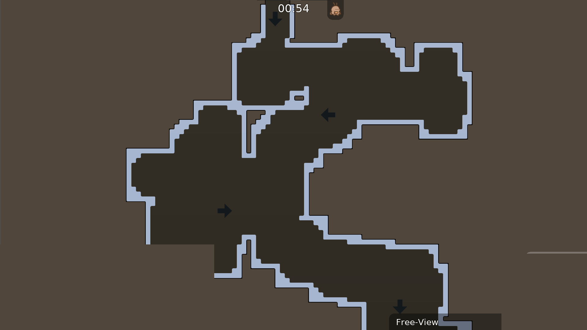
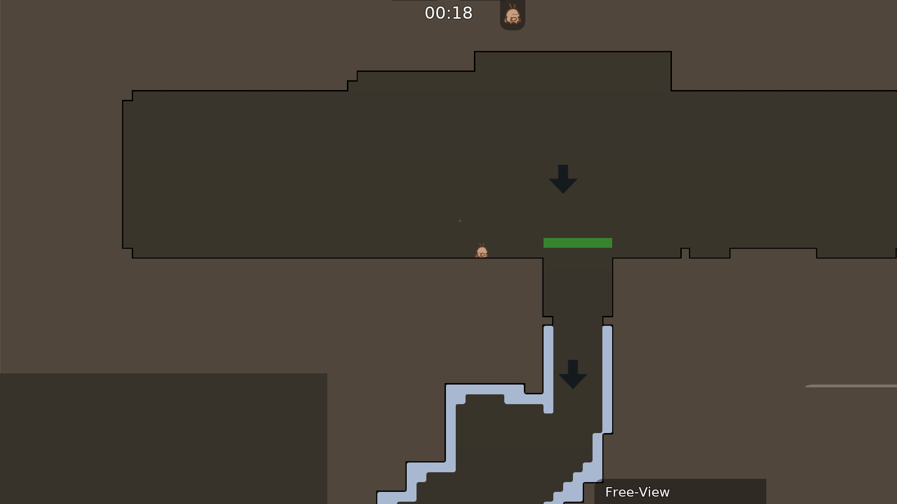
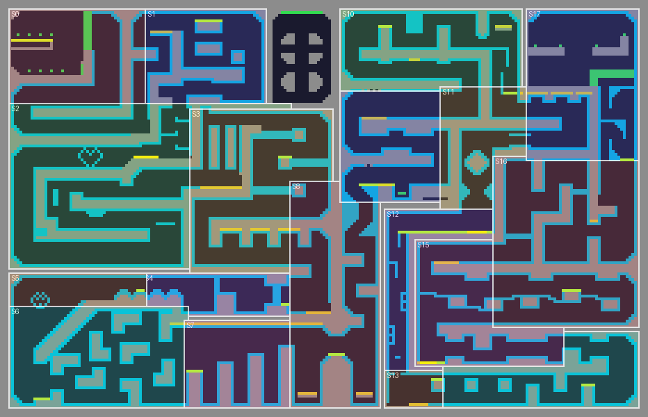
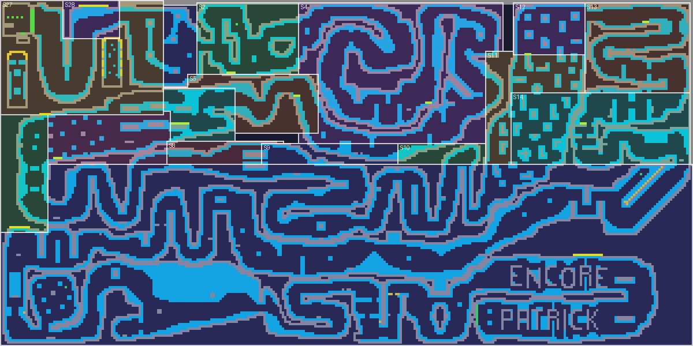
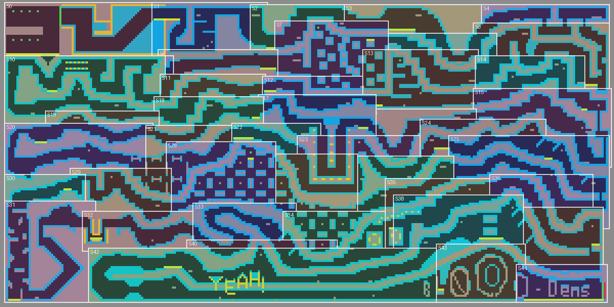
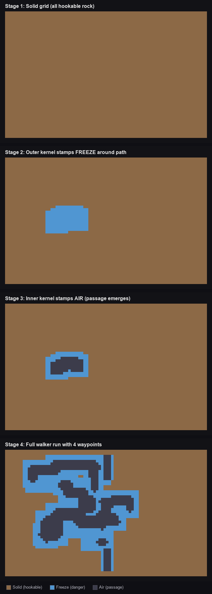

# tee-haven-mapgen

AI-driven Teeworlds Gores map generator. Combines LLM-based game design, a custom probabilistic two-kernel walker, data-driven challenge calibration from 47,000+ real map segments, and a DDNet automapper engine to produce fully playable `.map` files with themed visuals in under 3 seconds.

## What This Project Does

1. **Analyzes** 892 real Gores maps using BFS path tracing and Voronoi segmentation, extracting 47K+ gameplay segments
2. **Clusters** those segments into a vocabulary of challenge types based on structural similarity
3. **Plans** new maps via an LLM (GPT-4o) that selects challenge sequences, difficulty curves, and visual themes from the learned vocabulary
4. **Generates** each segment using a two-kernel walker algorithm that carves organic passages through solid terrain
5. **Validates** playability with BFS connectivity checks, passage width enforcement, and freeze border verification
6. **Themes** the output with a custom DDNet automapper engine supporting 7 visual themes
7. **Exports** complete `.map` files with spawn/finish lobbies, BFS-pathfinded navigation arrows, and gradient backgrounds

The entire pipeline is orchestrated as a LangGraph state machine with retry logic on validation failures.

## In-Game Results

### Desert Theme
| Corridor | Start Line |
|----------|------------|
|  |  |

### Winter Theme
| Corridor | Overview |
|----------|----------|
|  |  |

### Jungle Theme
| Corridor | Overview |
|----------|----------|
|  |  |

### Classic Gores Theme
| Corridor | Overview |
|----------|----------|
|  |  |

### Walls Theme
| Corridor | Overview |
|----------|----------|
|  |  |

## Technical Highlights

### BFS Segmentation Algorithm

The analysis pipeline segments real Gores maps into gameplay sections by simulating player movement. BFS floods from spawn through air, freeze, and teleporters with 8-directional movement. Each tile receives a step number encoding path distance from spawn. Checkpoints (horizontal platforms with air above) are ordered by BFS discovery time, then every tile is assigned to its most recent checkpoint via Voronoi assignment.

This solves the hard problem of segmenting winding maps: tiles in the same spatial column but at different heights get different step numbers because the player reaches them at different points in the journey. Column-based slicing fails here; BFS-based assignment handles it naturally.

### Two-Kernel Walker

The generation core. Carves passages through a solid grid by stepping between waypoints, applying two kernels per step:

1. **Outer kernel** places FREEZE where the grid is SOLID (barrier padding)
2. **Inner kernel** places AIR inside the outer footprint (playable passage)

Because the outer kernel runs first and never overwrites air, freeze naturally wraps every air tile. Connected passages with correct freeze borders emerge from the algorithm itself, not from post-processing.

Parameters per challenge type: `inner_size` (passage width), `outer_margin` (freeze thickness), `momentum_prob` (path straightness), `circularity` (kernel shape). These are calibrated from real map segment statistics.

### DDNet Automapper Engine

A from-scratch implementation of DDNet's automapper rule system in Python. Parses `.rules` files, evaluates 2-run rule chains with proper semantics:
- **FULL/EMPTY** conditions check the source grid (does a tile exist here?)
- **INDEX/NOTINDEX** conditions check the output grid (what visual was assigned?)
