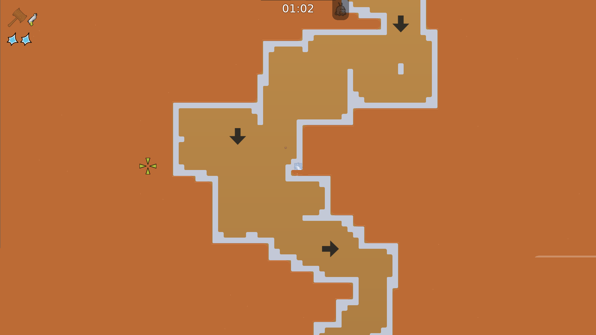
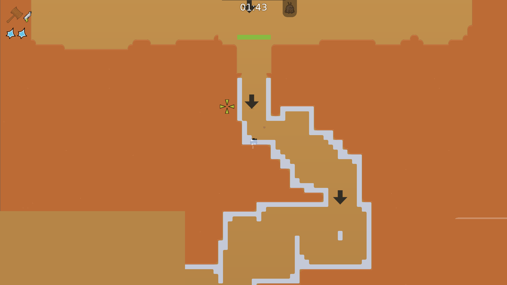
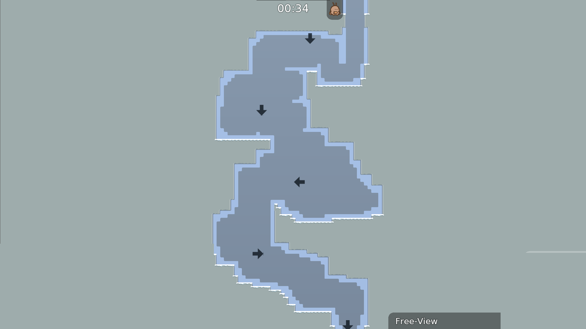
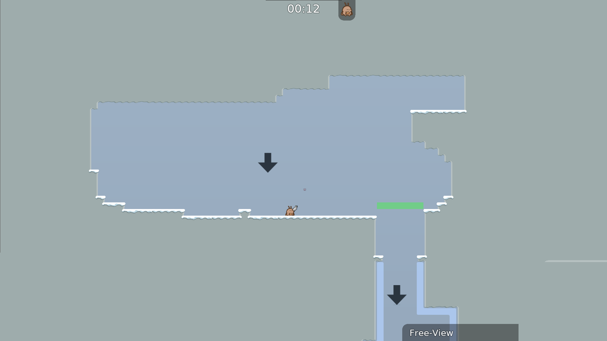
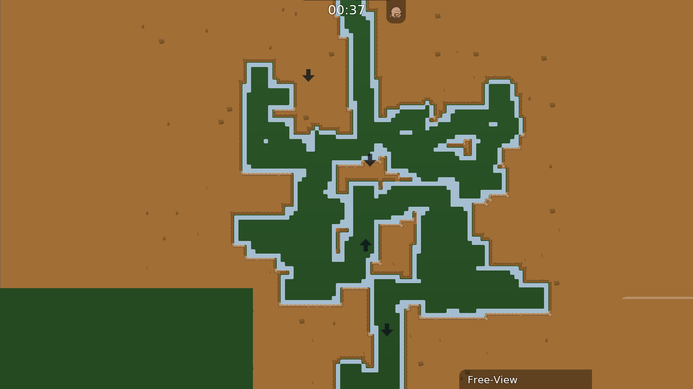
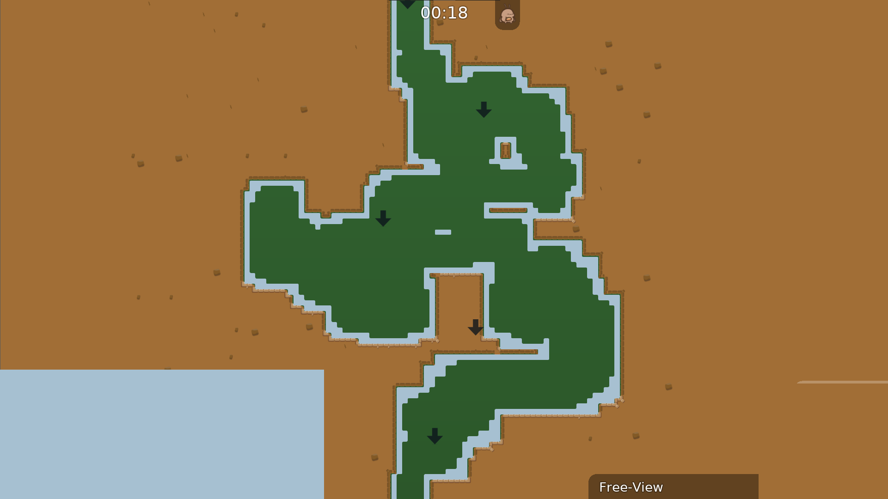
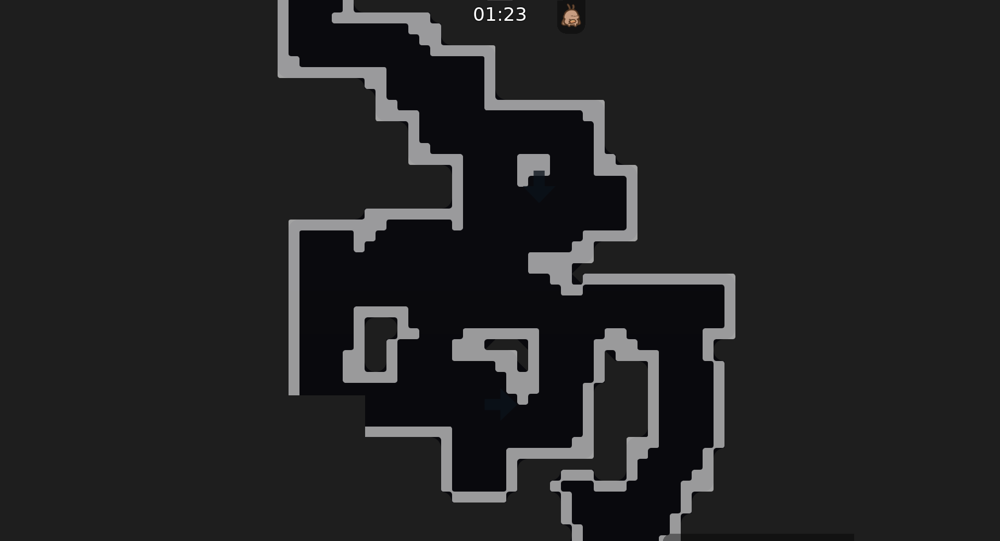
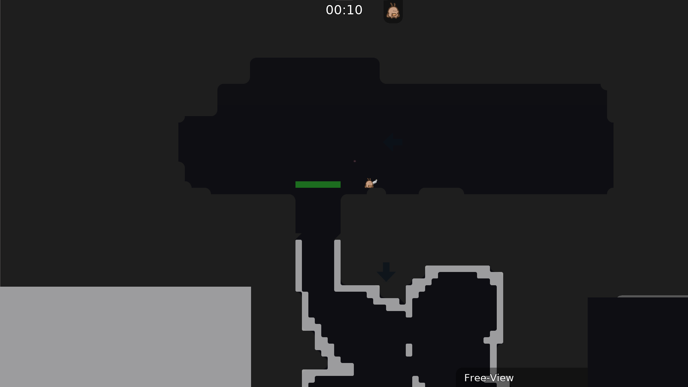

# tee-haven-mapgen

AI-driven Teeworlds Gores map generator. Combines LLM-based game design, a custom probabilistic two-kernel walker, data-driven challenge calibration from 47,000+ real map segments, and a DDNet automapper engine to produce fully playable `.map` files with themed visuals in under 3 seconds.

## What This Project Does

1. **Analyzes** 892 real Gores maps using BFS path tracing and Voronoi segmentation, extracting 47K+ gameplay segments
2. **Clusters** those segments into a vocabulary of challenge types based on structural similarity
3. **Plans** new maps via an LLM (GPT-4o) that selects challenge sequences, difficulty curves, and visual themes from the learned vocabulary
4. **Generates** each segment using a two-kernel walker algorithm that carves organic passages through solid terrain
5. **Validates** playability with BFS connectivity checks, passage width enforcement, and freeze border verification
6. **Themes** the output with a custom DDNet automapper engine supporting 7 visual themes
7. **Exports** complete `.map` files with spawn/finish lobbies, BFS-pathfinded navigation arrows, and gradient backgrounds

The entire pipeline is orchestrated as a LangGraph state machine with retry logic on validation failures.

## In-Game Results

### Desert Theme
| Corridor | Start Line |
|----------|------------|
|  |  |

### Winter Theme
| Corridor | Overview |
|----------|----------|
|  |  |

### Jungle Theme
| Corridor | Overview |
|----------|----------|
|  |  |

### Classic Gores Theme
| Corridor | Overview |
|----------|----------|
|  |  |

